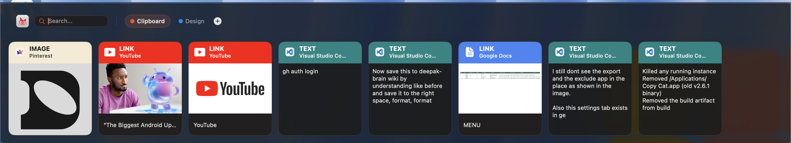

<div align="center">
  

  # Copy Cat

  **A visual redesign of Maccy — the clipboard manager you already love.**

  [](https://www.apple.com/macos/)
  [](LICENSE)
  [](https://github.com/p0deje/Maccy)

</div>

---

Copy Cat is a fork of [Maccy](https://github.com/p0deje/Maccy) rebuilt with a **visual card-based panel**, pinboards, link previews, and export — while keeping the same lightweight, privacy-first philosophy and zero cloud dependency.

---

## What's New vs Maccy

| | Maccy | Copy Cat |
|---|:---:|:---:|
| UI | Text list | Visual card strip |
| Link previews | — | OG thumbnail + title |
| Pinboards | — | Named, colour-coded boards |
| Pin items inside pinboards | — | ✓ |
| Excluded apps UI | Settings only | Searchable toggle list |
| Export | — | CSV (.zip) + PDF |
| App-branded card headers | — | Brand colour per app |
| Core clipboard engine | ✓ | Same — NSPasteboard |
| Global hotkey | ✓ | Same — configurable |

---

## Features

- **Visual card strip** — every clipboard item is a 160×180 card showing the source app icon, content type badge (TEXT / LINK / IMAGE / FILE), and a live content preview
- **OG link thumbnails** — URL cards automatically fetch Open Graph images and titles; results are cached to disk so subsequent opens are instant with no network hit
- **Pinboards** — create named boards with custom colours; drag cards from the clipboard strip onto any board tab; pin items within a board to keep them at the front
- **Excluded apps** — searchable toggle list of all installed apps; toggling an app off hides its items from the clipboard (items are not deleted — re-enabling the app restores them instantly)
- **Export** — export your full clipboard history and all pinboards as a CSV zip archive or a formatted PDF
- **Menu bar popup** — click the status icon for one-click access to History Limit, Export CSV, Export PDF, and Excluded Apps
- **Same storage, same shortcuts** — drop-in replacement for Maccy; all existing keyboard shortcuts and history are preserved

---

## Screenshots



---

## Install

### Option A — DMG (recommended)

1. Download **CopyCat.dmg** from [**Releases →**](../../releases/latest)
2. Open the DMG and drag **Copy Cat** to your **Applications** folder
3. Launch Copy Cat from Applications
4. On first run, grant **Accessibility permission** when prompted *(required for auto-paste)*

> **First-launch Gatekeeper notice:** Copy Cat is not notarized. On the first open, **right-click → Open** to bypass the "unidentified developer" warning. This is a one-time step.

### Option B — Build from source

```sh
git clone https://github.com/deepakkrishnar1618-svg/copy-cat.git
cd copy-cat
bash scripts/make-dmg.sh
```

Requires Xcode 16+ and macOS 14+.

---

## Usage

| Action | How |
|---|---|
| Open clipboard panel | Click status bar icon → **Open Clipboard** |
| Search across everything | Type in the search bar (filters clipboard + all pinboards) |
| Paste an item | Click any card — panel closes and item pastes automatically |
| Pin / unpin | Hover a card and click the **pin icon**, or right-click → Pin |
| Create a pinboard | Click **+** in the toolbar |
| Move a card to a pinboard | Drag card onto a pinboard tab |
| Excluded apps | Status bar icon → **Excluded Apps…** |
| Export history | Status bar icon → **Export CSV (.zip)…** or **Export PDF…** |
| History limit | Status bar icon → change the **History Limit** field |

---

## Requirements

- macOS Sonoma 14 or higher
- Accessibility permission (System Settings → Privacy & Security → Accessibility)

---

## Building the DMG

```sh
bash scripts/make-dmg.sh
```

This builds a Release configuration, stages the `.app` with an `/Applications` symlink, and outputs `CopyCat-2.6.1.dmg` in the project root.

---

## Attribution

Copy Cat is a fork of [Maccy](https://github.com/p0deje/Maccy) by [@p0deje](https://github.com/p0deje).  
The core clipboard engine, keyboard shortcut system, Sparkle updater, and settings infrastructure come from the original project. New UI, pinboards, OG thumbnails, export, and excluded-apps panel are original additions.

---

## License

MIT — see [LICENSE](LICENSE)
